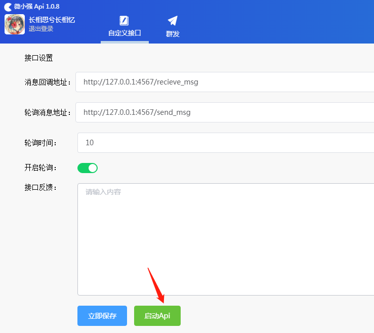
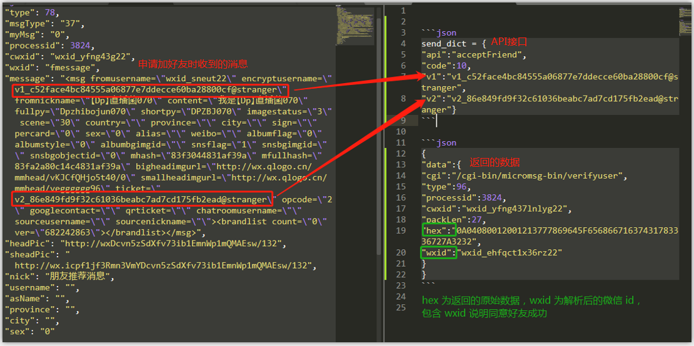

# WeChat API 个人微信号API/微信协议/独家接口/PC hook
# 适配所有类型个人微信号及版本
# 支持傻瓜式二次开发
# WeQuick 接口规范


------
**商务合作请加微信：Displore_23**


正常使用软件不会导致封号。 

**杀毒软件会对软件的正常运行构成影响，导致各种问题，请在使用前关闭杀毒软件。**

------

目录：
+ [接口介绍](#intro)
+ [接口服务端demo(python版)](#demo)
+ [消息回调接口](#send_msg)
    - [所有关于登陆事件](#login)
    - [登陆二维码](#qrCode)
    - [登陆状态](#loginInfo)
    - [登陆后获取个人信息或者其他的信息](#loginAfterInfo)
    - [好友列表详细信息](#friendsListDetails)
    - [获取群列表](#getGroupList)
    - [获取群成员列表](#getListGroupMembers)
    - [消息](#message)
    - [网络获取联系人数据](#networkAccessContactData)
    - [新建群后返回群id](#returnGroupId)
    - [同意好友](#acceptingFriend)
    - [获取v2](#getv2)
    - [退出微信事件](#logout)
    - [手机退出微信触发事件](#phoneLogout)
+ [轮询消息接口](#recieve_msg)
    - [发送消息](#sendMessage)
        * [发送文本消息](#text)
        * [发送图片消息](#img)
        * [发送文件消息](#file)
        * [发送xml消息](#xml)
        * [发送名片消息](#sendCard)
    - [好友操作](#friendsOperation)
        * [获取联系人](#getFriends)
        * [添加好友](#addFriend)
        * [删除好友](#destroyFriend)
        * [查询好友信息](#queryFriendInfo)
        * [同意新好友](#agreeNewFriends)
    - [群操作](#roomOperation)
        * [获取所有群列表](#getRooms)
        * [修改群名称](#editRoomName)
        * [踢群成员](#destoryRoomMember)
        * [获取群成员列表](#getRoomMembers)
        * [修改群备注名称](#editRoomAsName)
        * [获取群成员v2然后就可以加好友](#getRoomMemberV2)
        * [群邀请](#groupInvitation)
    - [其他操作](#other)
        * [获取登陆状态](#getLoginState)
        * [登陆二维码](#loginQrCode)
        * [退出登陆微信](#getLogout)
+ [商务合作](#cooperation)

------

<a name="intro"></a>
## 接口介绍

> 一个软件开启一个微信程序，点击自定义接口，录入消息回调地址，轮询消息地址，点击立即保存，点击启动API即可。



> 消息回调地址：当 PC 微信有新事件产生，如收到新消息时，包括全部系统消息，都将通过该接口 post 消息到服务端。

> 轮询消息地址：可设置轮询时间间隔，定时轮询服务端是否有任务执行。

> wechat多开，注意需要从客户端(WeQuick)唤起，一个客户端对应一个微信，对应一个processid。

<a name="demo"></a>
## 接口服务端demo(python版)
[https://github.com/juguang2018/WeQuick](https://github.com/juguang2018/wequick)

> (demo的原理是开启httpServer服务,处理客户端(WeQuick)发送过来的的http请求，然后返回相应的respone)

<a name="send_msg"></a>
## 一·消息回调
> 只要是 pc 微信接收到的消息都能收到，这个是客户端(WeQuick)主动推送给服务端的。

<a name="login"></a>
### 所有关于登陆事件 type:67
数据格式示例:
```json
{
"data":
    {
        "processid": 6072,
        "type": 67,
        "code": 200,
        "cwxid": "wxid_yfng437lnlygXXX"
    }
}
```

<a name="qrCode"></a>
### 登陆二维码 type:401
```json
// hex 二维码
{
    "data":{
        "cgi":"/cgi-bin/micromsg-bin/getloginqrcode",
        "type":82,
        "processid":5884,
        "cwxid":"wxid_yfng437l",
        "packLen":3689,
        "hex":"data:image/png;base64,iVBORw0KGgoAAAANSUhEUgAAALkAAAC"
    }
}
```

<a name="loginInfo"></a>
### 登陆状态
```json
// code 200 表示 已登陆
// code -1  表示 未登陆
{
"data":
    {
        "type":66,
        "code":200
    }
}
```

<a name="loginAfterInfo"></a>
### 登陆后获取个人信息或者其他的信息 type:71
```json
{
"data":
    {
        "username": "yqxxxx",
        "processid": 6072,
        "type": 71,
        "cwxid": "wxid_yfng437lnlygXXX",
        "wxid": "wxid_yfng437lnlygXXX",
        "headPic": "http://wx.qlogo.cn/mmhead/ver_1/4wJLicLp7zzib6cfVlQUgYBcTQFOE/0",
        "sheadPic": "http://wx.qlogo.cn/mmhead/ver_1/4wJLid1cHOWY0p6ctcUgYBcTQFOE/132",
        "nick": "bigxxx",
        "asName": "",
        "province": "",
        "city": "",
        "sex": "2",
        "regionCode": "",
        "sign": ""
    }
}
```

<a name="friendsListDetails"></a>
### 好友列表详细信息 type:210
```json
{
"data":
    {
        "type": 210,
        "processid": 8308,
        "cwxid": "wxid_sadaxxxxx",
        "userLists":
            [
                {
                    "wxid": "gh_e456599aa7XXX",
                    "asName": "(null)",
                    "headPic":  "http://wx.qlogo.cn/mmhead/Q3auHgzwC6lpicvsSLj53d1Xe54w/0",
                    "sheadPic": "http://wx.qlogo.cn/mmhead/Q3auHgz6lpicvsSLj53d1Xe54w/132",
                    "nick": "微及时XXX",
                    "username": "wsdXXX",
                    "province": "上海",
                    "city": "中国",
                    "sex": 0,
                    "regionCode": "",
                    "sign": "",
                    "type": 3,
                    "groupId": "None",
                    "cwxid": "xxxxxxxx"
                }
            ]
    }
}
```

<a name="getGroupList"></a>
### 获取群列表 type:211
```json
// wxid： 群id； exist: 是否在这个群里
// count: 群成员数量； userLists: 群成员的 wxid， ^G 为分隔符 
// roomLord： 是否是群主； headPic：头像地址； sheadPic: 缩略图
// nick: 群聊名称； 其他字段主要是好友才需要的字段，对于群忽略就好
{
"data":
    {
        "type": 211,
        "processid": 6072,
        "cwxid": "wxid_yfng437lnlygXXX",
        "chatrooms":
        [
            {
                "wxid":"23376255333@chatroom",
                "exist":true,
                "count":4,
                "userLists":"^Gwxid_qg0222^Ghechs^Gwxid_22^Gwxid_rzzg11^G",
                "roomLord":false,
                "headPic":"http://wx.qlogo.cn/mmkNlvZ/0",
                "sheadPic":"http://wx.qlogo.cn/mmcrTcxt8kNlvZ/0",
                "nick":"测试",
                "username":"",
                "asName":"",
                "province":"",
                "city":"",
                "sex":"0",
                "regionCode":"",
                "sign":""
            }
        ] 
    } 
}
```

<a name="getListGroupMembers"></a>
### 获取群成员列表 type:77
```json  
{
"data":
    {
        "type":77,
        "processid":8844,
        "cwxid":"wxid_yfng437lnlygXXX",
        "wxid":"75101150XXX@chatroom",
        "info":"PD94bWwgdmVyc2lvbj0iMS4wIj8dDMWE3\r\naWE5SWJ1WDJkc3dLaWFVVlhIWjdZM0",
        "userLists":
        [
            {
                "wxid":"yly_11XXX",
                "headPic":"http://wx.qlogo.cnic5Kic1pMzgK30S8YY8iblHY0Qc/0",
                "sheadPic":"http://wx.qlogo.cn/mmhead/ver_1/XDXmlHY0Qc/132",
                "nick":"微及时xxx",
                "username":"",
                "asName":"",
                "province":"",
                "city":"",
                "sex":"2",
                "regionCode":"",
                "sign":""
            },
            {
                "wxid":"wxid_pigclv404o2iXXX",
                "headPic":"http://wx.qlogo.cn/mmhead/ver_1/dfnqH5NbvwHMEKU71HOVLiaVTw/0",
                "sheadPic":"http://wx.qlogo.cn/mmhead/ver_1/dfnSxxwHMEKU71HOVLiaVTw/132",
                "nick":"微及时xxx",
                "username":"bigxxx",
                "asName":"",
                "province":"",
                "city":"",
                "sex":"0",
                "regionCode":"",
                "sign":""
            }
        ]
    }
}

```

<a name="message"></a>
### 系统消息 文本消息 卡片消息 视频消息 图片消息 群消息 等等消息综合 type:78
数据格式示例:
```json
{
    "type": 78,                     // int        信息分类，如接受消息，好友变动消息，群邀请信息等
    "msgType": "1",                 // string     信息类型，新好友（37）、系统消息（10000）、文本（1）、图片（3）
    "processid" : "7768",           // int        进程ID 
    "cwxid" : "wxid_adskjfseXXX",   // string     当前登陆的微信号
    "wxid"  : "wxid_sadkwqlXXX",    // string     发送方的微信ID，如果发送方为群，怎为群ID
    "formWxid" :"wxid_sadkwqlkq",   // string     只有群消息才有，为发送方个人的微信ID
    "nick" : "XXXX",                // string     用户昵称，如果是群则为群昵称
    "message" : "XXXX",             // string     消息内容
}
```

<a name="networkAccessContactData"></a>
### 网络获取联系人数据 type:88 
```json
{
"data":
    {
        "cgi":"/cgi-bin/micromsg-bin/getcontact",
        "type":88,
        "processid":6072,
        "cwxid":"wxid_yfng437lnlygXXX",
        "packLen":809,
        "hex":"0A040800120010011A99060A0B2040A0080038FFFFFFFF0",
        "wxid":"",
        "v1":"",
        "v2":""
    }
}
```

<a name="returnGroupId"></a>
### 新建(操作)群后返回群id type:69
```json
{
"data":
    {
        "type":69,
        "cwxid":"wxid_yfng437lnlygXXX",
        "xml":"",
        "chatroom":"218138553XXX@chatroom"
    }
}
```

<a name="acceptingFriend"></a>
### 同意好友 type:96
```json
// hex： 16进制的数据，包含所有联系人的 wxid
// wxid： 处理过的hex中的 wxid，包含 wxid 说明同意好友成功
{
    "data":
    {
        "cgi":"/cgi-bin/micromsg-bin/verifyuser",
        "type":96,
        "processid":6072,
        "cwxid":"wxid_yfng437lnlyXXX",
        "packLen":6,
        "hex":"0A04080012001A6C76315F653839616E676572", 
        "wxid":"XXX"
    }
}
```

<a name="getv2"></a>
### 获取v2 type:81
```json
{
"data":
    {
        "type":81,
        "processid":6072,
        "cwxid":"wxid_yfng437lnlyXXX",
        "wxid":"wxid_qg0saisth0rXXX",
        "v2":"v2_8a0384d4c6cb06add95851691b613d873b202311f358cc247c6891@stranger",
        "headPic":"http://wx.qlogo.cn/mmhead/ver_1/sD1PwMFiciclycKqvicF81uTEo/0",
        "sheadPic":"http://wx.qlogo.cn/mmhead/ver_1/sRAFiciclycKqvicF81uTEo/132",
        "nick":"DaQiXXX",
        "username":"e1030XXX",
        "asName":"",
        "province":"",
        "city":"上海",
        "sex":"1",
        "regionCode":"CN",
        "sign":""
    }
}
```

<a name="logout"></a>
### 退出微信事件 type:90
```json
{
"data":{
    "cgi":"/cgi-bin/micromsg-bin/logout",
    "type":90,
    "processid":6072,
    "cwxid":"wxid_yfng437lnlyxxx",
    "packLen":6,
    "hex":"0A0408001200", 
    }
}
```

<a name="phoneLogout"></a>
### 手机退出微信触发事件 type:98
```json
{
"data":{
    "cgi":"/cgi-bin/micromsg-bin/autoauth",
    "type":98,
    "processid":6072,
    "cwxid":"wxid_yfng437lnlyxxx",
    "packLen":433,
    "hex":"0AAC02089CFFFFFFFFFF00280038001A0608001000280032020800",
    }
}
```

<a name="recieve_msg"></a>
## 二·轮询消息
> 该接口是服务端定时轮询客户端(WeQuick)来执行服务端发出的任务，轮询时间可以自己设置，默认时间单位为秒，以下所有接口中字段time为非必须，加time字段可以单独控制某个任务发送的延迟时间。
<a name="sendMessage"></a>
### 发送消息:
<a name="text"></a>
1. 发送文本消息：
数据格式: 
```json
{"api":"sendTextMessage", "wxid":"wxid_qg0saisth0r2XXX", "text":"测试", "time":1}
```
<a name="img"></a>
2. 发送图片消息：
数据格式: 
```json
{"api":"sendPicMessage", "wxid":"wxid_asdasdXXX", "imgPath":"图片路径", "time":1}
```
<a name="file"></a>
3. 发送文件：
数据格式: 
```json
{"api":"sendFileMessage", "wxid":"wxid_asdasdXXX", "filePath":"文件路径", "time":1}
```
<a name="xml"></a>
4. 发送链接
数据格式: 
```json
{"api":"sendXmlMessage", "wxid":"wxid_asdasdXXX", "title":"标题", "url":"url链接", "desc":"描述", "pic":"图片url链接", "time":1}
```

<a name="sendCard"></a>
5. 发送名片
数据格式：
```json
{"api":"sendCardMessage","wxid":"推荐名片的wxid","fwxid":"要发送的wxid"}
```

<a name="friendsOperation"></a>
### 好友操作:
<a name="getFriends"></a>
1. 获取联系人：
数据格式:
```json
{"api":"initContact"}
```
<a name="addFriend"></a>
2. 添加好友:
数据格式:
```json
 {"api":"addUserEvent", "wxid":"wxid_qg0saisth0r2XXX", "message":"您好"}
```
<a name="destroyFriend"></a>
3. 删除好友:
数据格式:
```json
 {"api":"delUser", "wxid":"wxid_qg0saisth0r2XXX"}
```
<a name="queryFriendInfo"></a>
4. 查询好友信息(一次最多五十人):
数据格式:
```json
 {"api":"newGetUserLists", "wxidLists":["wxid_qg0saisth0r2XXX", "asdad30XXX"]}
```

<a name="agreeNewFriends"></a>

5. 同意新好友（收到type78中msg.type=10000说明已经添加了好友）
数据格式：
```json
{"api":"acceptFriend", "v1":"xxx", "v2":"xxx"}
```
使用详细介绍如图


<a name="roomOperation"></a>
### 群操作:
<a name="getRooms"></a>
1. 获取所有群列表:
数据格式: 
```json
{"api":"getChatRoomLists"}
```
<a name="editRoomName"></a>
2. 修改群名称:

更新中

<a name="destoryRoomMember"></a>
3. 踢群成员:
数据格式: 
```json
{"api":"delChatRoomUser", "chatroom":"237230488XXX@chatroom", "wxid":"dasfada30XXX"}
```
<a name="getRoomMembers"></a>
4. 获取群成员列表:
数据格式: 
```json
{"api":"getChatRoomUserLists", "wxid":"75101150XXX@chatroom"}
```
<a name="editRoomAsName"></a>
5. 修改群备注名称(我在本群的昵称)
数据格式: 
```json
{"api":"updateRoomAsName", "chatroom":"237230488XXX@chatroom", "name":"修改群备注名称测试"}
```
<a name="getRoomMemberV2"></a>
6. 获取群成员v2然后就可以加好友(返回type:88)
数据格式：
```json
{"api":"getRoomUserV2", "chatroom":"75101150XXX@chatroom","wxid":"wxid_zxzs0isl4unhXXX"}
```
<a name="groupInvitation"></a>
7. 群邀请
数据格式：
```json
{"api":"sendChatroom", "wxid":"wxid_qg0saisth0r2XXX", "chatroom":"237230488XXX@chatroom"}
```

<a name="other"></a>
### 其他
<a name="getLoginState"></a>
1. 获取登陆状态
数据格式：
```json
{"api":"isLoginInfo"}
```

<a name="loginQrCode"></a>
2. 登陆二维码
数据格式：
```json
{"api":"getLoginQrCode"}
```

<a name="getLogout"></a>
3. 退出登陆微信
数据格式：
```json
{"api":"outLogin"}
```

<a name="cooperation"></a>
## 商务合作

